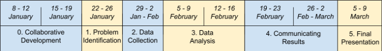
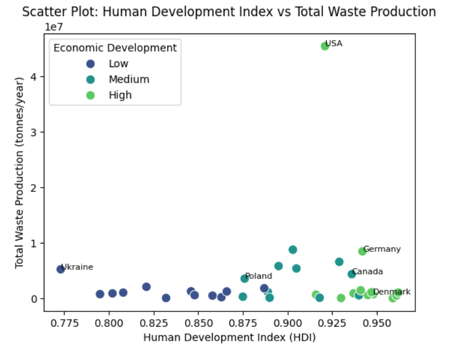
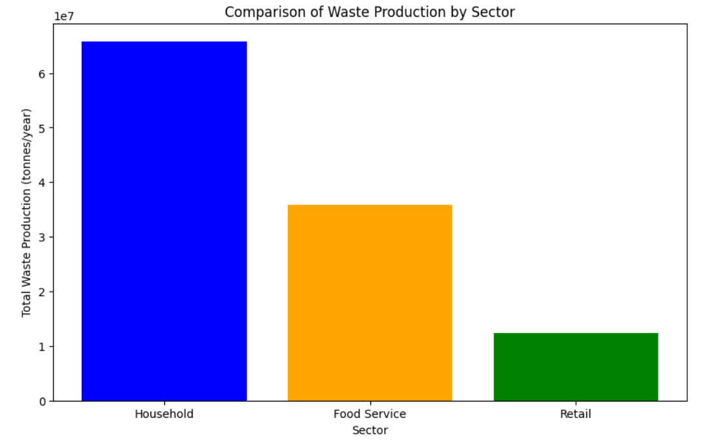

# Zero Waste Initiative

### Milestones timeframe

## Overview

Zero Waste offers a systematic approach to avoiding or reusing waste with the aim of minimizing its disposal into landfills. It's a strategic resource management paradigm that is becoming increasingly relevant in today's world, where the need for sustainable development and efficient resource utilization is evident.

# [Milestone 0: Problem Identification](./milestone/milestone_1)

### **Date: 8-19 January, 2024**

## Core Issues

- **Technological Innovations:** What new technologies can be utilized for waste collection, sorting, and processing to achieve zero waste?
- **Educational Programs:** How can public awareness regarding the importance of Zero Waste programs be raised and encourage the adoption of new eco-friendly habits?
- **Waste Management in Cities:** What urban management strategies can facilitate the successful implementation of Zero Waste programs in large cities?

## Generating Ideas and Making Progress

Brainstorm new and creative solutions to reduce waste and promote zero waste initiatives. Test these ideas through simulations or small-scale projects to evaluate effectiveness. Continuously iterate and refine solutions based on feedback from participants and data analysis. Ensure that all solutions are user-friendly, culturally appropriate, and considerate of all stakeholders' perspectives.

## Methodology

- **Understanding People:** Gather insights from personal experiences and data obtained from open sources to analyze stakeholders' perspectives on waste management.
- **Defining the Issue:** Analyze statements from various stakeholder groups to identify key challenges and opportunities in waste management.
- **Generating Ideas and Making Progress:** Engage in collaborative brainstorming sessions to devise innovative solutions. Test these ideas through simulations or small-scale projects, continuously iterating based on feedback and data analysis.

# [Milestone 1: Problem Identification]()

### **Date: 22-26 January, 2024**

## Milestone overview:

You can check and see problem-statement based on our personal experiences by country where we live.

- [Group_member_experience](./milestone/milestone_2/our_experience.md)

## Actionable Research Questions

During the project, we reviewed our trajectory and, guided by our datasets, opted to refine our questions by making them more specific and focused.

~~1. What effective methods can integrate cultural and geographical differences into Zero Waste programs?~~

~~2. What strategies for incentivizing innovation in waste management can ensure greater success of Zero Waste programs?~~

~~3. What evaluation tools can be applied to measure the effectiveness of Zero Waste programs and their impact on the environment?~~

1. What is the average per capita household food waste in the studied region, and how does it vary across different income brackets or urban and rural areas?
2. What is the collective economic impact of food waste on a global scale, and how does it affect different regions economically?
3. Are there correlations between the economic prosperity of a region and its success in implementing effective food waste reduction initiatives?

## Documents that related to our group:

1. [Group Norms](./collaboration/README.md)
2. [Constraints](./collaboration/constraints.md)
3. [Communication](./collaboration/communication.md)
4. [Learning goals](./collaboration/learning_goals.md)

## Milestone retrospective

- [Retrospective 1](./retrospective/retrospective_1.md)

## 🌱 Problem Statement

While Zero Waste programs have a positive environmental impact, there are certain challenges that complicate their implementation and effectiveness. For instance, cultural and geographical differences may hinder the adoption of new consumption practices and waste management strategies.

## Understanding of the Problem Domain

ZeroWaste practices in the food industry, including restaurants and delivery services, are paramount to reducing environmental impact and promoting sustainability. However, significant challenges persist in implementing effective ZeroWaste strategies across diverse sectors of the food industry.

## Region of overview

Our team working with data and analysis globally but with acent on countries where we currently live.

# [Milestone 2: Problem Identification](./milestone/milestone_2)

### **Date: 29 January - 2 February, 2024**

## Milestone overview:

## Non-Technical Explanation of Domain Modeling

Domain modeling in our Zero Waste project involves creating a simplified, yet comprehensive representation of the key aspects related to waste management. Think of it as a way to visually capture the essential elements and relationships within the system we're addressing. In our case, this includes understanding how various factors such as economic indicators, cultural differences, and geographical aspects influence waste generation and management practices.

Imagine it as a map that helps us navigate the complexities of waste reduction strategies. We identify the major landmarks, like economic development and cultural norms, and map out the connections between them. This visual guide aids us in developing a clear understanding of how these elements interact and impact our overall goal of achieving Zero Waste.

By having this non-technical model, we're better equipped to communicate insights, spot potential challenges, and guide our decision-making process. It's like having a simplified blueprint that allows us to see the bigger picture and make informed choices on the most effective strategies to reduce waste and promote sustainability.

## Data Set Documentation

We linked to datasets from USDA, FeedAmerica and UN organizations. We use dataset from USDA, UN, NGOs. It is give us wide and big picture of our related problems.

Link to Data Set(includes sources): [**Data Set**](https://1drv.ms/x/s!AgDpCOgvTPWroG6YVK6Ut_Wk3KeY?e=ghfJ5p)

1. [**Household food Waste by country**](./milestone/milestone_3/analysis_waste/household_waste.csv)
2. [**Service food Waste by country**](./milestone/milestone_3/analysis_waste/food_service_waste.csv)
3. [**Retail food Waste by country**](./milestone/milestone_3/analysis_waste/retail_food_waste.csv)

## Data Collection and Cleaning Scripts

To ensure transparency and the ability to replicate our work, we have provided all scripts for data collection and cleaning in our directory. This encompasses the entire process, including the partitioning of data into training and validation sets.

## Our Research Work

Our team is engaged in research in the field of Data Science, focusing on the implementation of zero waste programs. Learning from practical experience and utilizing modern data analysis methods, we aim to develop our skills and make a significant contribution to this field.

For more details on our own experience, please refer to [**our_experience**](./milestone/milestone_2/our_experience.md).

## Milestone retrospective

- [Retrospective 2](./retrospective/retrospective_2.md)

# [Milestone 3: Data Analysis](./milestone/milestone_3)

### **Date: 5-16 February, 2024**

## Overview:

The project is based on the analysis of the relationship between economic indicators and waste generation using a dataset extracted from the [2021 UNEP Food Waste Index Report](</extras/FWD%20(1).xlsx>).

## `Non-technical explanation of our findings`

In our exploration of the relationship between economic indicators and global waste generation patterns, we've uncovered several noteworthy insights. Our dataset, encompassing diverse countries, allowed us to observe trends and variations in economic factors and waste production.

## Key Findings:

### 1. Working Hours and Wages:

- On average, countries maintain a standard working week of around 38.2 hours, with variations.

- Monthly minimum wages exhibit substantial diversity, ranging from 170 to 3298.4 USD.

### 2. Financial Indicators:

- Lending rates vary widely, averaging at 6.03%, reflecting the financial diversity among nations.

- GDP per capita averages at 57.90 thousand USD, showcasing economic differences.

### 3. Human Development Index (HDI):

- The HDI indicates a high level of development across the considered countries, with an average of 0.894.

### 4. Waste Production:

- Total waste production spans from 38.8 thousand tonnes to 45.4 million tonnes, emphasizing the significant environmental impact.

## `Levels of Certainty`

While we express moderate to high confidence in our findings, it's crucial to acknowledge the complexities and potential uncertainties associated with our analysis. The following factors contribute to our level of certainty:

- Data Limitations: Our findings rely on the available dataset, and any limitations or gaps in the data may influence the accuracy of our conclusions.

- Assumptions: We made certain assumptions during our analysis, and any deviations from these assumptions could introduce uncertainties in our findings.

- Sampling Variability: If the analysis involved sampling, there may be inherent variability. Our observations represent patterns in the sample, and variations could exist in a broader population.

## Technical description of analysis

This section presents the results of the data analysis conducted using Jupyter Notebook -
[**Analysis**](/milestone/milestone_3/total_analysis.ipynb)

| Technique                         | Objective                                                                   | Rationale                                                                                                                               |
| --------------------------------- | --------------------------------------------------------------------------- | --------------------------------------------------------------------------------------------------------------------------------------- |
| `Data Cleaning`                   | Handled missing values and normalized column names for uniformity.          | Clean data is essential for accurate analysis, and normalization facilitates consistent comparisons.                                    |
| `Exploratory Data Analysis (EDA)` | Utilized histograms to understand data distribution.                        | Histograms provide a visual overview of the data, aiding in identifying patterns and potential outliers.                                |
| `Correlation Analysis`            | Explored correlations between economic indicators and waste generation.     | Understanding correlations helps identify potential relationships and guide further analysis.                                           |
| `Regression Analysis`             | Conducted regression analysis for predicting waste generation levels.       | Regression allows for the exploration of relationships between independent and dependent variables, aiding in prediction.               |
| `Geospatial Analysis`             | Visualized waste distribution across regions using geospatial maps.         | Geospatial analysis provides a spatial context to waste generation patterns, offering a comprehensive view.                             |
| `Machine Learning Prediction`     | Used linear regression to predict waste generation levels for future years. | Machine learning models offer a quantitative approach to predict trends and patterns in data, contributing to informed decision-making. |

## `Technical explanation of our findings`

## Key Findings and Insights

## 1. Household Food Waste Across Regions: Unraveling the Tapestry of Per Capita Waste and Socioeconomic Disparities

In this section of the project, we aimed to address the first research question: "What is the average per capita household food waste in the studied region, and how does it vary across different income brackets or urban and rural areas?"

### Variability in Per Capita Household Food Waste:

- Poland and the USA exhibit similar levels of per capita household food waste, while Germany and Ukraine have moderately elevated values.
- Canada and Denmark show higher estimates, indicating advanced waste management systems, possibly due to effective sorting and recycling programs and responsible population attitudes.

### Consumption Patterns:

- The United States leads in food service expenditures, with variations observed among countries like Germany, Denmark, Poland, Canada, and Ukraine.
- Diverse distribution hints at evolving trends influenced by consumption strategies and legislative landscapes, emphasizing varying policy needs for food waste management.

### Retail Waste Patterns:

- Germany has the lowest retail waste, while Canada and Poland exhibit moderate values.
- The United States and Ukraine show slightly higher retail waste, but Denmark stands out with significantly higher levels influenced by factors like limited local production and higher affluence.

## 2. Global Economic Impact of Food Waste: Unveiling the Interplay of Economic Consequences and Regional Disparities

In this segment, we sought to delve into the second research question: "What is the collective economic impact of food waste on a global scale, and how does it affect different regions economically?" This exploration involved examining the overall economic ramifications of food waste worldwide and discerning its distinct effects on various regions

### Volume of Food Waste Production:

- The global average volume is around 3.17 million tonnes, leading to significant economic losses due to devaluation and inefficient resource utilization.

### Regional Disparities:

- Higher development level countries like the USA have larger volumes of food waste compared to lower development level countries like Ukraine and Portugal.

### Economic Indicators and Food Waste:

- Regression analysis suggests limited impact of indicators like average weekly working hours and minimum wages on predicting food waste volumes, but they are still factors worth considering.

### Correlations:

- Countries with higher GDP per capita tend to generate more food waste, emphasizing the link between economic indicators and waste production.

### Conclusions:

- Global economic impact involves substantial losses, resource inefficiency, and increased expenditures on transportation and storage.
- Disparities in economic development define food waste volumes, and economic indicators interact with induced food waste.

## 3. Exploring the Relationship Between Economic Prosperity and Food Waste Reduction Initiatives

In this segment, our primary objective was to delve into the third research question: "Do correlations exist between the economic prosperity of a region and its success in implementing effective food waste reduction initiatives?" This inquiry was undertaken to uncover the intricate connections between a region's economic well-being and its capacity to execute impactful strategies aimed at reducing food waste.

### Data Gap Consideration:

- Analysis identified variations, emphasizing the need for additional research to fill data gaps, highlighting the importance of comprehensive and reliable data for robust conclusions.

### Sensitivity to Economic Factors:

- The model's sensitivity to economic indicators suggests that regions with higher economic development may have more resources and infrastructure for effective waste reduction initiatives.

### Risk Sources and Optimization:

- Identification of potential risk sources underscores the complexity of the relationship, suggesting optimization of data collection processes and consideration of additional factors.

### Planned Supplementary Research:

- The recommendation for supplementary research indicates a commitment to continuous improvement, recognizing the need for exploring evolving dynamics between economic prosperity and food waste reduction.

In conclusion, the analysis provides valuable insights into household food waste, the global economic impact of food waste, and potential correlations between economic prosperity and food waste reduction initiatives, highlighting the importance of further research and a holistic approach for a comprehensive understanding.

## `Possible Alternative Approaches`

### 1. Machine Learning Models:

- Explanation: Instead of traditional regression, machine learning models like Random Forest or Gradient Boosting could be explored for predictive modeling, potentially capturing non-linear relationships.

### 2. Robust Regression:

- Explanation: To address potential outliers impacting regression results, robust regression techniques like Huber regression could be considered.

### 3. Advanced Geospatial Techniques:

- Explanation: Utilizing more advanced geospatial analysis techniques, such as spatial autocorrelation, could provide deeper insights into regional waste distribution patterns.

### Applying the Results:

The findings can be used for further research and development of waste management strategies in the context of economic development.

---

_For a detailed analysis, refer to the [Full Project Analysis](./milestone/milestone_3/README.md) in the project repository._

## Milestone retrospective

- [Retrospective 3](/retrospective/retrospective_3.md)

## Scripts and documentation

### Scripts

[**analysis_waste**](./milestone/milestone_3/analysis_waste) - Detailed analysis of waste was conducted, including data type checking, data processing and cleaning, as well as statistical analysis.

[**Summary analysis**](./milestone/milestone_3/total_analysis.ipynb)-The dataset comprises estimates of household, food service, and retail waste per country, extracted from the 2021 UNEP Food Waste Index Report. It encompasses information on waste generation, confidence levels, and economic indicators such as GDP per capita, lending rates, and more.
[**Predictions**](./milestone/milestone_3/prediction/)- The analysis focuses on addressing data gaps, sensitivity scenarios, and risk sources, offering solutions for improvement

## `Conclusion:`

While the chosen analysis techniques have provided valuable insights, it's crucial to acknowledge potential flaws and consider alternative approaches to enhance the robustness of our findings. Adapting methods based on ongoing discoveries and advancements in data science ensures a dynamic and thorough analysis approach.

[Answers](./milestone/milestone_3/research_questions.md) for [Actionable Research Questions](./milestone/milestone_1/research_question.md).

**_Please be aware that the analysis is currently underway, and any updates or improvements will be incorporated into future milestones._**

### Documentation

[**Analysis_Waste**](./milestone/milestone_3/analysis_waste/README.md)

[**Analysis**](./milestone_3/README.md)

[**Machine Learning Prediction**](./milestone/milestone_3/prediction)

[**Prediction Analysis**](./milestone/milestone_3/prediction/analysis_code.md)

[**Prediction documentation**](./milestone/milestone_3/prediction/README.md)

What is the average per capita household food waste in the studied region, and how does it vary across different income brackets or urban and rural areas?
What is the collective economic impact of food waste on a global scale, and how does it affect different regions economically?
Are there correlations between the economic prosperity of a region and its success in implementing effective food waste reduction initiatives?

# Milestone 4: Communicating Results

### **Date: 19 February - 2 March, 2024**

## Milestone overview:

## Selecting the Target Audience:

Our target audience is Nonprofit Organizations that specialize in addressing social and environmental issues, including food waste. We are looking to engage organizations that have the greatest potential to influence the groups that waste food the most, such as households, food service and retail.

## Measures that Nonprofit Organizations can take to influence the reduction of food waste:

- Promoting conscious consumption: Organizations can conduct information campaigns and educational activities for consumers on healthy eating, responsible food handling and minimizing wastage.
- Supporting restaurants and catering establishments: Organizations can promote the implementation of programs for the storage and use of leftovers in restaurants and other food service establishments.
- Developing food recycling programs: Nonprofit organizations can promote the development of food recycling programs at food service locations. Be proactive in increasing the number of garbage cans in cities and providing them with biodegradable bags to encourage separate waste sorting and recycling.
- Establish partnerships with grocery stores and food suppliers: Organizations can partner with grocery stores and food providers to reduce food rejection and wastage.
- Support local initiatives to distribute free food: Organizations can organize programs to collect and distribute leftover food to local social service agencies or individuals in need.
- Develop technology to track and manage leftover food: Nonprofits can develop or support the development of technologies to help track and manage leftover food at various points in the supply chain.
- Political and public lobbying: Organizations can engage in lobbying for legislative changes or the development of community initiatives to reduce food waste.
- Monitoring and evaluation: Monitoring and evaluating the level of food waste in their sectors and jointly developing strategies to reduce it.
- Sponsoring educational programs: Supporting educational programs aimed at raising awareness of food waste.

## Limitations we may face:

- Financial Limitations: Non-profit organizations may have limited financial resources to participate in projects.
- Resource constraints: Some organizations may have limited resources to actively participate in projects.
- Partnership Opportunities: Nonprofit organizations can find new opportunities to collaborate and develop their activities.

## Ways to Achieve Cooperation:

Direct Appeal: We will approach non-profit organizations directly, offering cooperation and sharing resources to achieve a common goal.
Partnerships: Establishing partnerships with organizations, including sharing knowledge, resources and expertise.
Organizing Events: Holding joint events, workshops and trainings with non-profit organizations to raise awareness and collaboration in reducing food waste.

## The final decision

How we will present to them: a poster or a Power Point presentation (to be decided after Monday's workshop).

## Milestone retrospective

- [Retrospective 4](./retrospective/retrospective_4.md)

# Milestone 5: Final Presentation Event

### **Date: 5-9 January, 2024**

1. A 1-minute pitch for your solution.
2. A 3-minute presentation of your
   group’s process from beginning to end
   including challenges you faced,
   lessons you learned, and any advice
   you have for future learners.
3. A retrospective for this milestone.

# Contributing

We welcome contributions from individuals and organizations passionate about waste management and sustainability. To contribute, please follow these guidelines:

- Fork the repository and create a new branch for your contributions.
- Make your changes, ensuring they adhere to project guidelines and standards.
- Submit a pull request detailing the changes you've made and why they're beneficial.

Thank you for helping us make a positive impact on waste management!
